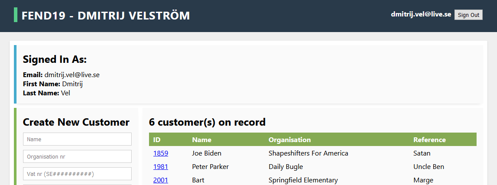
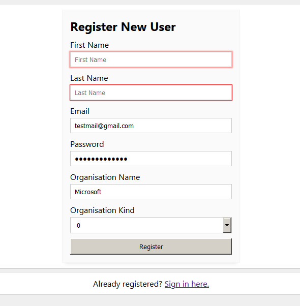
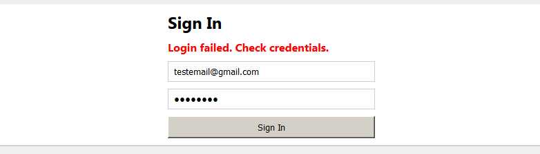
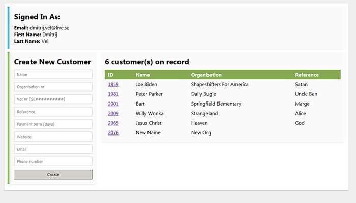
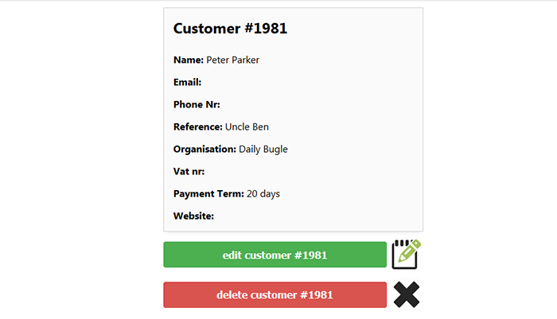

# FEND19 - JavaScript 3 - Excercise 2



In this excercise I developed a React application for managing customer accounts using an API provided by the course instructor.
Navigation between different pages within the application is done using [react-router-dom](https://reactrouter.com/) routing library.
User-specific functions for interacting with the api are collected in JSX Kit called [UserKit](src/data/UserKit.js). Dynamic parts of the application are updated using `useState` and `useEffect` React hooks.

:trophy: Customer list, active user information and other data is provided to multiple pages by using `useContext` provider.

```js
      <BusinessContext.Provider
        value={{
          activeUser,
          setActiveUser,
          customerList,
          fetchCustomerList,
          checkIfAuthorized,
          emailToVerify,
          setEmailToVerify
        }}
      >
        <Switch>
          <Route path="/edit-customer/:customerId" render={props => <EditCustomerPage {...props} />} />
          <Route path="/customer/:customerId" render={props => <CustomerDetailsPage {...props} />} />
          <Route path="/login" exact component={LoginPage} />
          // and so on ...
```

All styling for this project was written from scratch.

There is one exception to this with **react-super-responsive-table** npm package which requires it's own basic style sheet to be loaded in order for the project to compile. To enforce my own styling on the customer table I created an override scss file that is loaded immediately after the dependency:

See [CustomerTable.jsx](https://github.com/Dmitrijv/fend19-js3-ex2/blob/4d2d2d71509294881a348d4e472f06200eecc32f/src/components/customer/CustomerTable.jsx#L8)

```js
import "react-super-responsive-table/dist/SuperResponsiveTableStyle.css";
import "./../../styles/sass/_customer-table-override.scss";
```

A collection of basic component styles was created in [styles.js](src/styles/js/styles.js) file. Most components in the application use this collection.

```js
import styled from "styled-components";

const FlexContainer = styled.div`
  display: flex;
  flex-direction: column;
`;

const ColumnForm = styled.form`
  ${FlexContainer};
  button,
  input,
  select {
    width: 100%;
  }
`;
```

:trophy: Some components create their own styled elements by inheriting properties from a basic component and adding own properties on top.

```js
const CustomerSheet = styled(styles.InfoSheet)`
  width: 100%;
  margin: 0 auto;
  border: 1px solid lightgray;
  @media only screen and (min-width: 800px) {
    max-width: 420px;
  }
`;
```

## Creating a new account

In order to use the system you need to register an account. Registration form can be found at the root link of the application (`/`). From there it is also possible to navigate to login page if you already have an account. Input field properties are set up to conform to API requirements for a new user.



### Activating your account

If registration process succeeds user is asked to verify their new account by following an activation link that is sent to their email adress.


### Error handling

If account registration or activation is rejected by the server user is redirected to a relevant error page. This might happen if you attempt to register with an email adress that has already been used or attempt to use an expired activation link.

## Logging in to the system



Once your new account is activated you can log in to the system from the `/login` page. If your credentials are accepted by the server you will be redirected to the `/home` page where you will see a dashboard containing your account details, a table of your current customers as well as a form for creating new customers.



I have created object representations (templates) of all input fields. This allows me to build registration forms programmatically without hardcoding all of the form tags. See [InputField.jsx](src/components/InputField.jsx)

```js
  const customerInputFields = [
    { label: "Name", value: name, callback: setName, required: true, minLength: 1, maxLength: 50 },
    { label: "Organisation nr", value: organisationNr, callback: setOrganisationNr, maxLength: 30 },
    {
      label: "Vat nr",
      value: vatNr,
      callback: setVatNr,
      placeholder: "SE##########",
      maxLength: 12,
      pattern: "SE[0-9]{10}"
    },
    // and so on
```

:trophy: If you choose to supply a vat number for your new customer the form will only accept a string that starts with "SE" followed by 10 digits.

## Viewing customer details

If you click on the id of any customer you will be redirected to a "customer details" page where you will see all available information about that customer.



:trophy: From this page it is also possible to change information about the customer as well as delete this customer record entirely.
:trophy: Deleting or updating a customer will redirect you back to the `/home` page where a new list of customers will be loaded from the api to reflect any changes you have made.

## Project Dependencies

- [react-super-responsive-table](https://www.npmjs.com/package/react-super-responsive-table)

## Key

:trophy: - extra credit requirement
